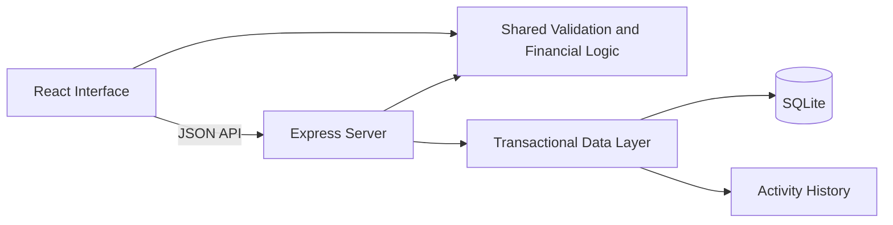

# Workforce EVREN

A full-stack staffing analytics platform for managing placements, modeling profitability, and explaining incentive calculations.


## Overview

Workforce EVREN helps staffing teams understand the financial performance of employee placements.

The application converts bill rates, pay rates, operating costs, and planned hours into clear estimates for:

- Monthly revenue
- Base wages
- Operating overhead
- Employer burden
- Gross profit and margin
- Incentive pools
- Net contribution

This project is a complete modernization of an older React and Firebase application. The original idea was rebuilt using current tools, typed business rules, persistent local storage, automated tests, and a responsive interface.

All included people and companies are fictional.

## Features

### Workforce dashboard

- View active placements and employees on the bench
- Review projected monthly revenue and profit
- Compare revenue across departments
- Identify placements with margins below the review threshold

### Team directory

- Search by employee name, role, or client
- Filter by placement status and department
- Sort by name, revenue, or margin
- Navigate paginated results
- Export matching records to CSV

### Placement management

- Add and edit team members
- Preview placement economics before saving
- Archive placements without permanently deleting them
- Restore archived placements to the bench
- Prevent stale browser windows from overwriting newer changes

### Scenario planner

- Experiment with bill rates and pay rates
- Adjust planned monthly hours
- Model operating overhead and employer burden
- Compare a proposed scenario with a saved placement
- Calculate the break-even bill rate
- Explore scenarios without modifying saved records

### Activity history

- Record placement creation, updates, archives, and restorations
- Store placement changes and audit events in one transaction
- Display the latest 100 workspace events

## Tech Stack

| Area | Technology |
| --- | --- |
| Frontend | React 19, TypeScript, Vite |
| Backend | Node.js, Express 5 |
| Database | SQLite |
| Validation | Zod |
| Icons | Lucide React |
| Testing | Vitest, React Testing Library, Supertest |
| Automation | GitHub Actions |
| Packaging | Docker and Docker Compose |

## Getting Started

### Requirements

Install Node.js 24.14 or newer within the Node 24 release line.

Confirm your version:

```bash
node --version
npm --version
```

### Installation

Clone the repository:

```bash
git clone https://github.com/YOUR_USERNAME/workforce-evren.git
cd workforce-evren
```

Install the dependencies:

```bash
npm ci
```

Start the development environment:

```bash
npm run dev
```

Open the application at:

```text
http://localhost:5173
```

The API runs at:

```text
http://localhost:3001
```

No API keys or environment file are required.

The first run creates a local SQLite database and adds 12 fictional placements. Changes remain available after restarting the application.

## Production Build

Create an optimized build:

```bash
npm run build
```

Run the frontend and API from one local server:

```bash
npm start
```

Open:

```text
http://localhost:3001
```

Stop `npm run dev` before starting the production server because both modes use API port 3001.

## Docker

If Docker is installed, the complete application can also be started with:

```bash
docker compose up --build
```

Open:

```text
http://localhost:3001
```

The Docker configuration preserves the SQLite database in a named volume.

## Financial Model

Workforce EVREN stores monetary values as integer cents to avoid floating-point rounding errors.

```text
Revenue = Bill rate × Monthly hours

Wages = Pay rate × Monthly hours

Operating overhead = Revenue × 8%

Employer burden = Wages × 12%

Gross profit =
  Revenue
  − Wages
  − Operating overhead
  − Employer burden

Gross margin = Gross profit ÷ Revenue

Net contribution = Gross profit − Incentive
```

### Incentive Policy

| Gross margin | Incentive |
| --- | ---: |
| Below 10% | 0% of positive gross profit |
| 10% to below 20% | 3% of positive gross profit |
| 20% to below 30% | 5% of positive gross profit |
| 30% and above | 8% of positive gross profit |

Tier selection uses the unrounded margin.

For example, a margin of `19.999%` remains in the 3% tier even if the interface displays it as `20.0%`.

### Example

For a placement with:

- $120 hourly bill rate
- $70 hourly pay rate
- 160 planned monthly hours

The application calculates:

| Item | Amount |
| --- | ---: |
| Revenue | $19,200 |
| Base wages | $11,200 |
| Operating overhead | $1,536 |
| Employer burden | $1,344 |
| Gross profit | $5,120 |
| Estimated incentive | $256 |
| Net contribution | $4,864 |

These calculations are planning estimates and are not payroll payments or recognized revenue.

## Architecture



```text
src/
  React screens, components, API client, and responsive styles

shared/
  Validation schemas, financial rules, seed data, and CSV export

server/
  Express API, SQLite storage, transactions, and server lifecycle

tests/
  Financial, API, persistence, and interface tests

docs/
  Architecture, API, modernization, verification, and demo guides
```

## Engineering Decisions

### Integer money values

Rates and financial results are stored as integer cents. This prevents common floating-point errors when calculating financial totals.

### Shared validation

The frontend and backend use the same Zod schema. The server remains the authoritative validation boundary and rejects unexpected properties.

### Optimistic concurrency

Every placement has a revision number. When two browser windows edit the same placement, an outdated revision receives an HTTP `409` response instead of silently overwriting newer data.

### Transactional activity history

Placement changes and their activity events are saved within the same SQLite transaction. If either operation fails, neither change is committed.

### Archive and restore

Placements are archived instead of permanently deleted. This keeps changes recoverable and preserves historical context.

### CSV safety

CSV values are properly quoted, and formula-like spreadsheet values are neutralized before export.

## Testing

Run the complete verification suite:

```bash
npm run check
```

This runs:

- Formatting verification
- Strict TypeScript checking
- 35 automated tests
- Production build verification

Run only the tests:

```bash
npm test
```

Run tests in watch mode:

```bash
npm run test:watch
```

The test suite covers:

- Financial calculations
- Exact incentive boundaries
- Zero-revenue and negative-margin scenarios
- Input validation
- SQLite persistence
- API error responses
- Archive and restore workflows
- Stale update protection
- CSV formula protection
- Search and filtering
- Failed-save recovery
- Scenario recalculation

## API

| Method | Endpoint | Purpose |
| --- | --- | --- |
| `GET` | `/api/health` | Check API health |
| `GET` | `/api/workspace` | Retrieve placements and activity |
| `POST` | `/api/employees` | Create a placement |
| `PUT` | `/api/employees/:id` | Update, archive, or restore a placement |

See [docs/API.md](docs/API.md) for the full request format, validation rules, and error responses.

## Security and Scope

Workforce EVREN is designed as a local, single-user portfolio application.

The project includes:

- Parameterized database statements
- Strict request validation
- Request-size limits
- Localhost host restrictions
- Cross-origin write protection
- Content Security Policy headers
- CSV formula-injection protection
- Safe error responses

It does not currently include authentication, user accounts, authorization, or tenant isolation. Do not expose the application publicly or store real employee information without adding those controls.

## Documentation

- [Architecture and tradeoffs](docs/ARCHITECTURE.md)
- [API documentation](docs/API.md)
- [Modernization notes](docs/MODERNIZATION.md)
- [Verification record](docs/VERIFICATION.md)
- [Interview demonstration guide](docs/DEMO.md)
- [GitHub publishing guide](docs/GITHUB.md)

## Future Improvements

Potential next steps include:

- Authentication and role-based access control
- PostgreSQL support for hosted deployments
- Historical financial snapshots
- Server-side filtering and pagination
- Placement notes and document attachments
- Client and recruiter management
- Automated deployment
- End-to-end browser testing
- Accessibility auditing
- Multi-currency support

## Project Background

Workforce EVREN was inspired by a legacy workforce-management project originally built with React 16, Redux, Firebase, and an early Material UI release.

The application was redesigned and rebuilt with a new interface, database, API, financial model, validation system, documentation, and automated tests.

See [docs/MODERNIZATION.md](docs/MODERNIZATION.md) for the detailed comparison.

## License

This project is available under the [MIT License](LICENSE).

---

Built as a portfolio project demonstrating full-stack development, financial modeling, database design, testing, accessibility, and technical documentation.
